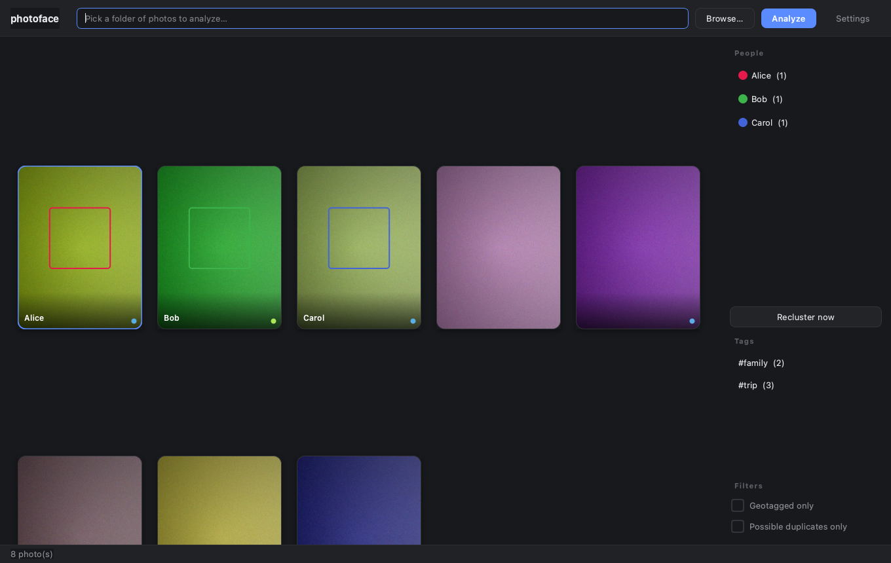
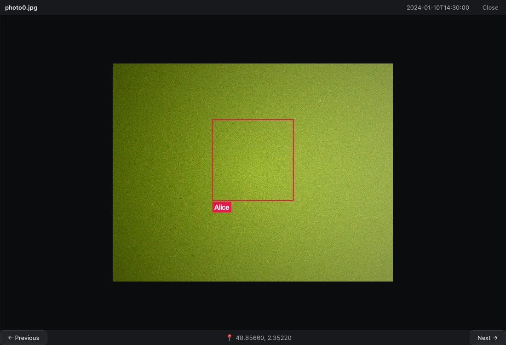

# photoface

[](https://github.com/heykav/photoface/actions/workflows/tests.yml)

A local-first desktop app (PySide6) that groups the people in a folder of
photos, without sending a single photo anywhere. Point it at a folder;
it detects faces (OpenCV YuNet), embeds them (SFace), clusters them into
people, and lets you browse by person, tag, place, or possible duplicate -
correcting the grouping by hand where it gets it wrong.

## What this is / is not

**It is** a private, offline browser and sorter for a personal photo folder,
with manual corrections that the automatic clustering respects ("pinned"
faces never move).

**It is not** a photo editor, a cloud service, or a face *identification*
system: it clusters faces that look alike within your library and never
names anyone on its own. Clustering quality depends on the SFace model and
on photo quality - expect some mistakes (that is what the manual pinning is
for). It does not modify, move, rename or delete your original photos.

## Privacy

- **All processing is local.** Detection, embedding, clustering, hashing and
  EXIF reading run on your machine. The code contains no telemetry, upload,
  or account logic (audited: the only network-capable code is listed below).
- **Network use, exhaustively:** (1) `scripts/download_models.py` downloads
  the two ONNX models from GitHub (opencv/opencv_zoo) once; (2) clicking
  "open in OpenStreetMap" in the lightbox opens your browser at
  openstreetmap.org with that photo's coordinates in the URL - only when you
  click it.
- **What is stored, and where** (nothing else is written):
  - `photoface.db` (SQLite): photo paths, size/mtime, dimensions, capture
    date and GPS from EXIF, a perceptual hash, face boxes, 128-number face
    embeddings, person names/colours, tags. Next to the code when run from
    source; `~/.photoface/` for a packaged build. Face embeddings are
    biometric-like data: delete this file to erase them.
  - `photoface.db.bak-v<N>`: a copy made before a schema upgrade.
  - `thumbcache/`: downsized JPEG thumbnails of your photos.
  - `models/`: the ONNX models (and `*.sha256` records).
  - Qt `QSettings` (view options, last folder path).
- Your original photos are only ever opened read-only.

## Screenshots

Gallery with per-person colored face boxes, tag dots, and the people/tags
sidebar:



Full-size lightbox view of a photo with the detected face outlined and
named, plus capture date and GPS coordinates:



(Both captured from the app itself with synthetic placeholder photos - your
own library will show your actual photos and faces in their place.)

## Features

- Recursively scans a folder for jpg/jpeg/png/webp/bmp/tiff images.
- Face detection with OpenCV **YuNet**, face embeddings with **SFace**
  (both fetched from the OpenCV Zoo).
- Two-stage clustering: a fast greedy incremental pass while analysis runs,
  then a full average-linkage re-clustering pass (`Recluster now` in the
  sidebar, or automatically after each analysis run).
- Manual face edits (move to another person, split off a new person, delete
  a false detection) are **pinned** - reclustering never moves a pinned
  face to a different person again, and two different pinned identities are
  never merged into each other.
- People sidebar: rename, merge, or delete a person; multi-select filters
  the gallery with AND semantics (photos where all selected people appear).
- **Tags**: right-click any photo (in the gallery) to add a tag or remove an
  existing one; each tag gets its own stable color (derived from its name)
  shown as a dot on the card; the tags sidebar list filters the gallery
  alongside the person filter, combined with AND.
- **Possible-duplicates detection**: every photo gets a perceptual hash
  (dHash) at analysis time; a sidebar toggle filters the gallery down to
  photos whose hash is within a small distance of another photo's - re-saves,
  light edits, or re-exports of the same shot - grouped with a union-find
  pass so a whole chain of near-duplicates surfaces together, not just pairs.
- Full-size lightbox viewer: mouse-wheel zoom centered on the cursor,
  click-drag pan, ←/→ or on-screen buttons to move through the *current
  filtered* set, Esc/background-click/✕ to close.
- **Gallery keyboard navigation**: arrow keys move the selection (grid-aware,
  using the current column count), Enter opens the selected photo, Esc clears
  the person filter.
- EXIF: capture date shown in the lightbox and used for date sorting; GPS
  coordinates shown, with copy-to-clipboard and "open in OpenStreetMap";
  a sidebar toggle filters the gallery to geotagged photos only.
- **Folder watching**: optionally watches the analyzed folder (and every
  subfolder) and automatically re-analyzes, debounced 2s after changes go
  quiet so a big copy operation triggers one re-scan, not dozens.
- Thumbnails are cached on disk (keyed by path + mtime), so a large library
  re-opens fast instead of re-decoding every photo.
- Settings dialog: preview aspect (3:4 or 4:3), face-box visibility on
  thumbnails, sort order, clustering similarity threshold, folder watching,
  log verbosity - all persisted between launches via `QSettings`.
- SQLite persistence; unchanged files (same mtime + size) are skipped on
  re-analysis instead of being re-detected from scratch. Schema changes
  (e.g. adding the duplicate-detection hash column) migrate forward
  automatically for an existing database (versioned via `PRAGMA user_version`,
  backed up first, and a database from a newer photoface is refused).

## Run from source

Requires Python 3.10+.

```bash
python3 -m venv .venv
source .venv/bin/activate
pip install -r requirements.txt
python scripts/download_models.py   # fetches + checks the YuNet and SFace ONNX models
python main.py
```

Type or browse to a folder in the top bar and press **Analyze**. On Linux,
PySide6 needs the system libraries `libegl1 libgl1 libxkbcommon0`
(headless/CI use: `QT_QPA_PLATFORM=offscreen`).

### Model integrity

`download_models.py` writes each model to a temporary file, hashes it, and
installs it atomically, so a truncated download is never mistaken for a
model; offline, it stops with the URL and the folder to copy the file into.
**SHA-256 values are not pinned yet** - I could not read the authoritative
checksums (Git LFS ids in opencv/opencv_zoo) when this was written and will
not invent them. Until they are pinned in `model_files.py`, the first
download is trusted, its digest is printed and recorded in
`models/<name>.sha256`, and every later start verifies against that record.
`python scripts/download_models.py --strict` refuses unpinned models.

## Tests

```bash
pip install -r requirements-dev.txt
QT_QPA_PLATFORM=offscreen pytest
```

151 tests, none needing the ONNX models or a display (a stub engine and
synthetic embeddings stand in): clustering properties and quality on
synthetic data (determinism, pinned faces never move, idempotence, empty and
single-member inputs, purity/completeness), database migrations and crash
rollback, "originals are never modified", EXIF/GPS edge cases, model-download
integrity, duplicate detection, and headless smoke tests of the real
`MainWindow`. CI (`.github/workflows/tests.yml`) runs them on Python
3.10-3.12 with Qt's offscreen platform, plus a lint job.

## How clustering behaves

Cosine similarity of SFace embeddings; default threshold 0.363 (the OpenCV
Zoo's published "same person" cutoff, adjustable in Settings - higher means
fewer false merges, lower means fewer split identities). The result is
deterministic for a given input order, pinned faces never change person,
reclustering twice changes nothing, and existing people (including renamed
ones) are reused rather than recreated. It runs as one database transaction.

Measured on *synthetic* 128-d embeddings only (`tests/synth.py`; real SFace
accuracy is not measured here because the models could not be downloaded in
the development sandbox): well-separated identities are recovered exactly
(purity 1.00, completeness 1.00); very noisy identities fragment (purity
1.00, completeness 0.34); identities whose centroids nearly coincide
collapse into one (purity 0.33) - no threshold fixes data that ambiguous.

## Project layout

| Path                         | Purpose                                          |
|------------------------------|---------------------------------------------------|
| `main.py`                    | Desktop entry point (QApplication + theme)        |
| `gui/`                       | PySide6 UI: main window, gallery, sidebar, lightbox, settings |
| `analyzer.py`                | Folder scanning, EXIF, perceptual hashing, face detection/embedding, ties clustering to the DB |
| `clustering.py`              | Greedy incremental assignment + average-linkage re-clustering + stable person mapping |
| `database.py`                | SQLite schema, versioned migrations, transactions, query helpers |
| `exif_utils.py`              | Defensive EXIF date / GPS parsing                 |
| `model_files.py`             | Model locations, verified download                |
| `paths.py`                   | Path resolution (source vs. a future frozen bundle) |
| `scripts/download_models.py` | Downloads YuNet and SFace ONNX models from the OpenCV Zoo |
| `tests/`                     | Pytest suite for `clustering.py`, `database.py`, and perceptual hashing |
| `.github/workflows/tests.yml`| CI: runs the test suite on Python 3.10-3.12       |

## Storage

- `photoface.db` next to the code when running from source (see `paths.py`
  for where a packaged build would put it instead).
- Thumbnail cache and downloaded models live in `thumbcache/` and `models/`.
- View settings (aspect, face-box visibility, sort order, clustering
  threshold, folder watching, log verbosity) are stored with Qt `QSettings`
  under the `photoface` organization/app name.

## Packaged executables

`.github/workflows/build.yml` builds macOS/Linux/Windows executables (via
PyInstaller, `photoface.spec`) and attaches them as a draft GitHub release
whenever a `v*` tag is pushed. Build locally with:

```bash
pip install pyinstaller
python scripts/download_models.py
pyinstaller photoface.spec
```

The macOS `.app` path was built and launch-tested locally (starts, detects
it's frozen, writes its database under `~/.photoface/` as designed, finds its
bundled model files under `Contents/Resources/models/`). The plain onedir
output used for Windows/Linux follows standard PyInstaller practice for
those platforms but is only actually exercised by CI, on real Windows/Linux
runners, before anything is attached to a release.

## Not yet built (ideas for a v2)

- A dedicated "review duplicates" flow (e.g. pick-one-to-keep, bulk delete)
  beyond just filtering the gallery down to the duplicate groups. Right now
  the app is honest about *which* photos are near-duplicates and gets out
  of the way of the decision about which one to keep — that's a conscious
  scope cut, not an oversight, but it's the first thing worth building next.
- Automated GUI interaction tests (the GUI is currently verified manually
  under an offscreen Qt platform, screenshotted and inspected, rather than
  covered by `pytest`). The clustering math and the database are the parts
  I'd actually lose sleep over being wrong, so that's where the automated
  coverage went first.

---

Made with ❤️ in India by [Krishna Anubhav](https://github.com/heykav).
