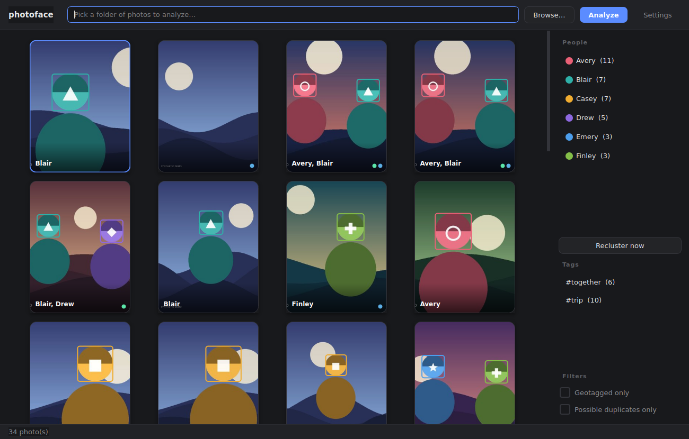
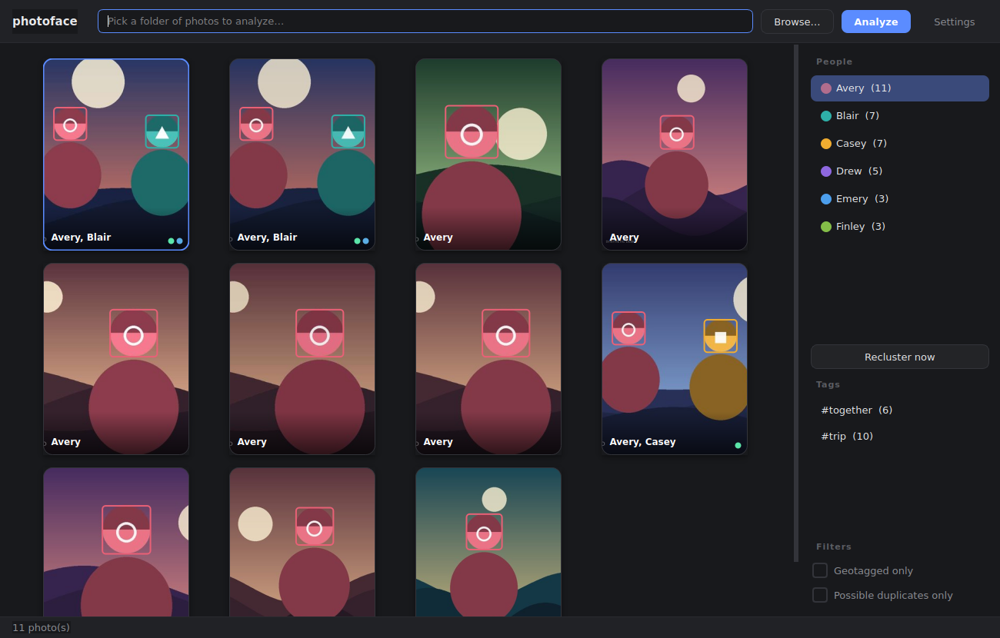
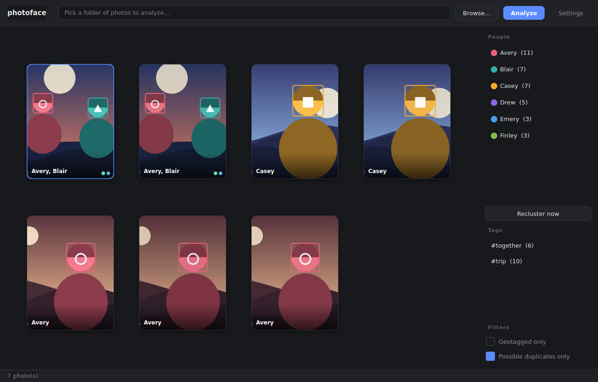
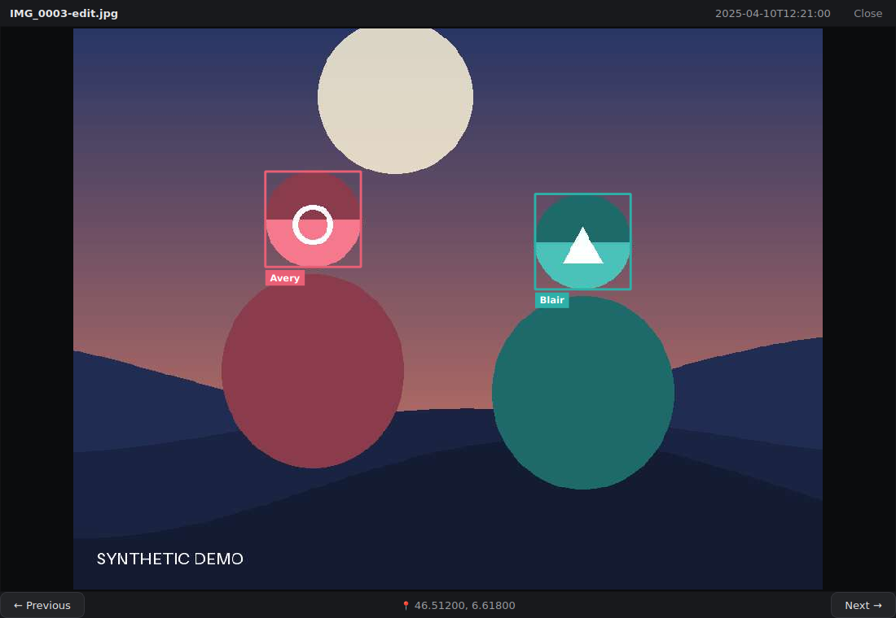
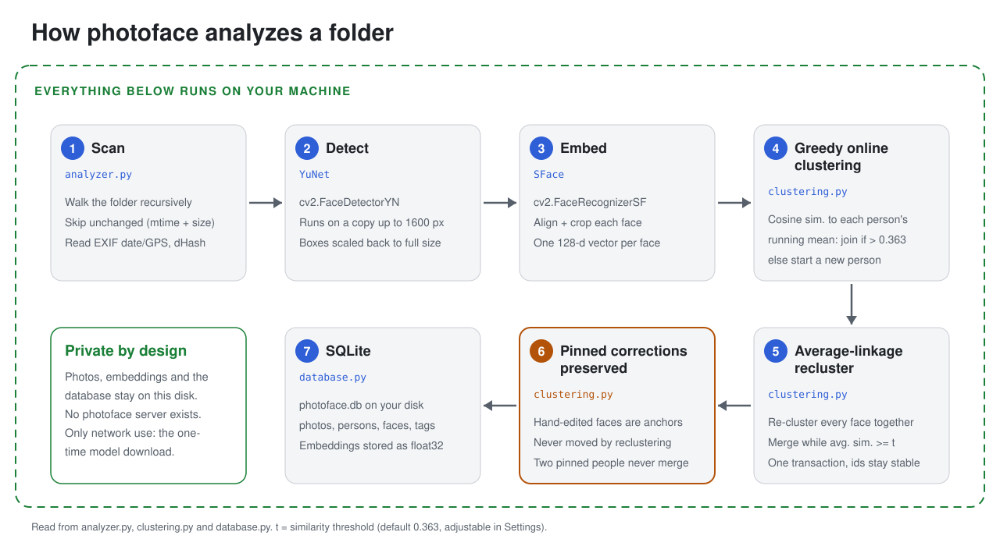
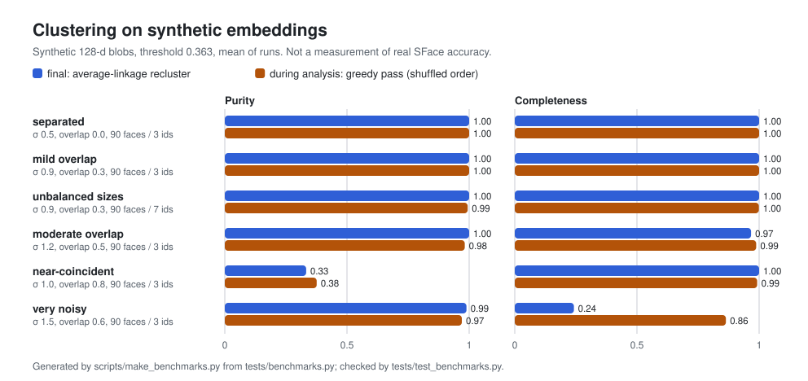

<p align="center">
  <picture>
    <source media="(prefers-color-scheme: dark)" srcset="docs/img/hero-dark.svg">
    <source media="(prefers-color-scheme: light)" srcset="docs/img/hero-light.svg">
    
  </picture>
</p>

# photoface

[](https://github.com/heykav/photoface/actions/workflows/tests.yml)

A local-first desktop app (PySide6) that groups the people in a folder of
photos, without sending a single photo anywhere. Point it at a folder;
it detects faces (OpenCV YuNet), embeds them (SFace), clusters them into
people, and lets you browse by person, tag, place, or possible duplicate -
correcting the grouping by hand where it gets it wrong.

## What this is / is not

**It is** a private, offline browser and sorter for a personal photo folder,
with manual corrections that the automatic clustering respects ("pinned"
faces never move).

**It is not** a photo editor, a cloud service, or a face *identification*
system: it clusters faces that look alike within your library and never
names anyone on its own. Clustering quality depends on the SFace model and
on photo quality - expect some mistakes (that is what the manual pinning is
for). It does not modify, move, rename or delete your original photos.

## Privacy

- **All processing is local.** Detection, embedding, clustering, hashing and
  EXIF reading run on your machine. The code contains no telemetry, upload,
  or account logic (audited: the only network-capable code is listed below).
- **Network use, exhaustively:** (1) `scripts/download_models.py` downloads
  the two ONNX models from GitHub (opencv/opencv_zoo) once; (2) clicking
  "open in OpenStreetMap" in the lightbox opens your browser at
  openstreetmap.org with that photo's coordinates in the URL - only when you
  click it. The app never calls the download code itself.
- **What leaves the machine:** no photo, thumbnail, face crop, embedding,
  file name or path is ever sent anywhere. The model download is a plain
  HTTPS GET to GitHub that carries nothing about your photos (GitHub sees
  your IP address and a Python user agent). The only photo-derived data
  that can leave is one photo's GPS latitude/longitude, in the
  OpenStreetMap URL, when you click that button.
- **What is stored, and where** (nothing else is written):
  - `photoface.db` (SQLite): photo paths, size/mtime, dimensions, capture
    date and GPS from EXIF, a perceptual hash, face boxes, 128-number face
    embeddings, person names/colours, tags. Next to the code when run from
    source; `~/.photoface/` for a packaged build. Face embeddings are
    biometric-like data: delete this file to erase them.
  - `photoface.db.bak-v<N>`: a copy made before a schema upgrade.
  - `thumbcache/`: downsized JPEG thumbnails of your photos.
  - `models/`: the ONNX models (and `*.sha256` records).
  - Qt `QSettings` (view options, last folder path).
- Your original photos are only ever opened read-only.

## Screenshots

**All images below are synthetic demo data.** No real person's photo is
shown: the "photos" are procedurally drawn, faceless avatar tokens, and the
face embeddings are synthetic (a stand-in engine replaces the YuNet/SFace
models, which were not available where these were made). Everything else -
scanning, EXIF/GPS parsing, greedy and average-linkage clustering, SQLite, and
the real Qt widgets - is the app's own code. They show how the interface
behaves, not how accurate real face recognition is. Regenerate them with
`python scripts/make_screenshots.py` (seeded; see the script's docstring).

| | |
|---|---|
|  |  |
| **People and gallery.** Six synthetic identities recovered as six people, with per-person face boxes and tag dots. | **One person's photos.** Selecting a person in the sidebar filters the grid. |
|  |  |
| **Possible duplicates.** Re-exports of the same shot surface together (perceptual-hash groups). | **Lightbox and EXIF.** Named face boxes, capture date, and a synthetic GPS position. |

Two earlier captures (also synthetic placeholder photos) are kept in
[`screenshots/`](screenshots/): [gallery](screenshots/gallery.png) and
[lightbox](screenshots/lightbox.png).

## How it works

<picture>
  <source media="(prefers-color-scheme: dark)" srcset="docs/img/pipeline-dark.svg">
  <source media="(prefers-color-scheme: light)" srcset="docs/img/pipeline-light.svg">
  
</picture>

## Features

- Recursively scans a folder for jpg/jpeg/png/webp/bmp/tiff images.
- Face detection with OpenCV **YuNet**, face embeddings with **SFace**
  (both fetched from the OpenCV Zoo).
- Two-stage clustering: a fast greedy incremental pass while analysis runs,
  then a full average-linkage re-clustering pass (`Recluster now` in the
  sidebar, or automatically after each analysis run).
- Manual face edits (move to another person, split off a new person, delete
  a false detection) are **pinned** - reclustering never moves a pinned
  face to a different person again, and two different pinned identities are
  never merged into each other.
- People sidebar: rename, merge, or delete a person; multi-select filters
  the gallery with AND semantics (photos where all selected people appear).
- **Tags**: right-click any photo (in the gallery) to add a tag or remove an
  existing one; each tag gets its own stable color (derived from its name)
  shown as a dot on the card; the tags sidebar list filters the gallery
  alongside the person filter, combined with AND.
- **Possible-duplicates detection**: every photo gets a perceptual hash
  (dHash) at analysis time; a sidebar toggle filters the gallery down to
  photos whose hash is within a small distance of another photo's - re-saves,
  light edits, or re-exports of the same shot - grouped with a union-find
  pass so a whole chain of near-duplicates surfaces together, not just pairs.
- Full-size lightbox viewer: mouse-wheel zoom centered on the cursor,
  click-drag pan, ←/→ or on-screen buttons to move through the *current
  filtered* set, Esc/background-click/✕ to close.
- **Gallery keyboard navigation**: arrow keys move the selection (grid-aware,
  using the current column count), Enter opens the selected photo, Esc clears
  the person filter.
- EXIF: capture date shown in the lightbox and used for date sorting; GPS
  coordinates shown, with copy-to-clipboard and "open in OpenStreetMap";
  a sidebar toggle filters the gallery to geotagged photos only.
- **Folder watching**: optionally watches the analyzed folder (and every
  subfolder) and automatically re-analyzes, debounced 2s after changes go
  quiet so a big copy operation triggers one re-scan, not dozens.
- Thumbnails are cached on disk (keyed by path + mtime), so a large library
  re-opens fast instead of re-decoding every photo.
- EXIF orientation is honoured everywhere (detection, thumbnails, lightbox,
  duplicate hash), so face boxes on rotated phone photos land on the face.
- Settings dialog: preview aspect (3:4 or 4:3), face-box visibility on
  thumbnails, sort order, clustering similarity threshold, folder watching,
  log verbosity - all persisted between launches via `QSettings`.
- SQLite persistence; unchanged files (same mtime + size) are skipped on
  re-analysis instead of being re-detected from scratch. Schema changes
  (e.g. adding the duplicate-detection hash column) migrate forward
  automatically for an existing database (versioned via `PRAGMA user_version`,
  backed up first, and a database from a newer photoface is refused).
  Schema v2 discards duplicate-detection hashes made before EXIF orientation
  was applied; the next **Analyze** recomputes them without re-detecting
  faces.

## Run from source

Requires Python 3.10+.

```bash
python3 -m venv .venv
source .venv/bin/activate
pip install -r requirements.txt
python scripts/download_models.py   # fetches + checks the models; see "Model integrity"
python main.py
```

Type or browse to a folder in the top bar and press **Analyze**. On Linux,
PySide6 needs the system libraries `libegl1 libgl1 libxkbcommon0`
(headless/CI use: `QT_QPA_PLATFORM=offscreen`).

### Model integrity

`download_models.py` writes each model to a temporary `*.part` file, checks
its SHA-256 (and size, when pinned), and only then renames it into place.
On any failure - offline, HTTP error, empty file, size or hash mismatch -
the temporary file is deleted and nothing is installed; an existing model
that fails its check is removed before re-downloading. The app re-checks
the models each time it loads them and refuses to use them if a check
fails.

The policy is **fail closed**: a model is only accepted when its expected
SHA-256 is known, either pinned in `model_files.MODELS` or recorded earlier
by an explicit trust-on-first-use step.

**SHA-256 values are not pinned yet.** The authoritative checksums are the
Git LFS object ids in opencv/opencv_zoo, which could not be read when this
was written, and they will not be invented. Until they are pinned, a plain
`python scripts/download_models.py` refuses to install the models. To
accept them anyway:

```bash
python scripts/download_models.py --trust-on-first-use
# or: PHOTOFACE_TRUST_ON_FIRST_USE=1 python scripts/download_models.py
```

This downloads the models (or hashes files you copied into `models/` by
hand), prints each SHA-256 and size, and records the hash in
`models/<name>.sha256`; every later run verifies against that record.
Compare the printed hashes with the LFS pointers of the two files in
https://github.com/opencv/opencv_zoo and paste them into `model_files.py`
to pin them. `--strict` refuses unpinned models even with trust-on-first-use.
The release workflow does not use trust-on-first-use, so tagged builds fail
until the hashes are pinned.

## Tests

```bash
pip install -r requirements-dev.txt
QT_QPA_PLATFORM=offscreen pytest
```

None of the tests need the ONNX models or a display (a stub engine and
synthetic embeddings stand in): clustering properties and quality on
synthetic data (determinism, pinned faces never move, idempotence, threshold
refinement, scale invariance, empty and single-member inputs,
purity/completeness, exact agreement with the previous full-matrix
implementation), database migrations and crash rollback, "originals are
never modified", EXIF/GPS edge cases, EXIF orientation, model-download
integrity, duplicate detection, the README's benchmark numbers against a
fresh run, and headless smoke tests of the real `MainWindow`. CI (`.github/workflows/tests.yml`) runs them on Python
3.10-3.12 with Qt's offscreen platform, plus a lint job.

## How clustering behaves

Cosine similarity of SFace embeddings; default threshold 0.363 (the OpenCV
Zoo's published "same person" cutoff, adjustable in Settings - higher means
fewer false merges, lower means fewer split identities). The result is
deterministic for a given input order, pinned faces never change person,
reclustering twice changes nothing, and existing people (including renamed
ones) are reused rather than recreated. It runs as one database transaction.

- **During analysis** a greedy pass compares each new face with the mean of
  every person's unit-length embeddings and joins the closest one if the
  similarity is above the threshold. Its result depends on the order faces
  arrive in.
- **Afterwards** an average-linkage pass reclusters every face: it keeps
  merging the pair of groups with the highest average pairwise similarity
  while that average is at least the threshold. The partition does not
  depend on input order (barring exact ties), a stricter threshold only ever
  splits groups, and each group holds pinned faces of at most one person.
  It keeps one n x n float64 matrix: 8 n^2 bytes, about 0.8 GB for 10,000
  faces. That is the practical limit of this design.

### Measured on synthetic data

Real SFace accuracy is **not** measured here: the models could not be
downloaded where this was developed. The numbers below come from synthetic
128-d embeddings (`tests/synth.py`: each identity is a noisy blob around a
random centroid; "overlap" pulls all centroids toward one direction), are
regenerated by `python scripts/make_benchmarks.py`, and are checked against
a fresh run by `tests/test_benchmarks.py`. *Purity*: share of faces whose
cluster is mostly their own identity. *Completeness*: share of faces whose
identity is mostly in their cluster.

<picture>
  <source media="(prefers-color-scheme: dark)" srcset="docs/img/clustering-benchmark-dark.svg">
  <source media="(prefers-color-scheme: light)" srcset="docs/img/clustering-benchmark-light.svg">
  
</picture>

<!-- benchmark:clustering:start -->
Threshold 0.363, 5 seeds per scenario (greedy pass: 4 shuffled input orders per seed). Mean over runs, worst run in parentheses.

| Scenario | faces / identities | noise σ | overlap | recluster purity | recluster completeness | recluster clusters | greedy purity | greedy completeness | greedy clusters |
|---|---|---|---|---|---|---|---|---|---|
| separated | 90 / 3 | 0.5 | 0.0 | 1.00 (1.00) | 1.00 (1.00) | 3.0 | 1.00 (1.00) | 1.00 (1.00) | 3.0 |
| mild overlap | 90 / 3 | 0.9 | 0.3 | 1.00 (1.00) | 1.00 (1.00) | 3.0 | 1.00 (1.00) | 1.00 (1.00) | 3.0 |
| unbalanced sizes | 90 / 7 | 0.9 | 0.3 | 1.00 (1.00) | 1.00 (1.00) | 7.0 | 0.99 (0.97) | 1.00 (0.99) | 6.5 |
| moderate overlap | 90 / 3 | 1.2 | 0.5 | 1.00 (1.00) | 0.97 (0.94) | 5.6 | 0.98 (0.67) | 0.99 (0.93) | 3.6 |
| near-coincident | 90 / 3 | 1.0 | 0.8 | 0.33 (0.33) | 1.00 (1.00) | 1.0 | 0.38 (0.33) | 0.99 (0.86) | 1.1 |
| very noisy | 90 / 3 | 1.5 | 0.6 | 0.99 (0.97) | 0.24 (0.17) | 38.4 | 0.97 (0.67) | 0.86 (0.76) | 10.2 |
<!-- benchmark:clustering:end -->

What this shows, and where it fails:

- Separated and mildly overlapping identities are recovered exactly by the
  final pass, including an unbalanced library with singletons.
- **Near-coincident identities collapse into one person** in both passes; no
  threshold fixes data that ambiguous (that is what manual splitting and
  pinning are for).
- **Very noisy identities shatter under average linkage** (dozens of small
  clusters) while the greedy pass keeps them far more complete: with this
  much noise two faces of one identity are, on average, *less* similar than
  the threshold, but a face is still similar to the identity's mean. The
  final recluster replaces the greedy result, so in this regime it makes
  the grouping worse. Whether real SFace embeddings ever look like this is
  not known here.
- The greedy pass is order-dependent: its worst run is visibly worse than
  its mean in the overlapping scenarios.

## Duplicate detection

Each photo gets a 64-bit difference hash (dHash) of its upright (EXIF
orientation applied) 9x8 grayscale thumbnail; photos within 4 bits of each
other are grouped (union-find, so chains group together). A hash of all
zeros (a flat, single-colour frame) never counts as a duplicate. Measured on
procedurally drawn synthetic scenes (`tests/benchmarks.py`), not on real
photos:

<!-- benchmark:duplicates:start -->
60 synthetic scenes; share of copies whose dHash is within k bits of the original (the app groups at k <= 4). Last row: share of the 1770 pairs of *different* scenes within k bits (false positives).

| Copy made by | median bits | worst | k <= 2 | k <= 4 | k <= 6 | k <= 8 |
|---|---|---|---|---|---|---|
| resize to 50% | 0 | 5 | 97% | 98% | 100% | 100% |
| resize to 200% | 0 | 2 | 100% | 100% | 100% | 100% |
| JPEG quality 90 | 0 | 7 | 90% | 97% | 98% | 100% |
| JPEG quality 70 | 1 | 5 | 78% | 90% | 100% | 100% |
| JPEG quality 40 | 1 | 6 | 77% | 88% | 100% | 100% |
| crop 2% per side | 2 | 5 | 72% | 95% | 100% | 100% |
| crop 5% per side | 3 | 10 | 38% | 72% | 87% | 95% |
| crop 10% per side | 6 | 18 | 15% | 33% | 55% | 73% |
| brightness -20% | 1 | 7 | 72% | 87% | 97% | 100% |
| brightness +20% | 3.5 | 29 | 42% | 57% | 67% | 75% |
| contrast +30% | 3.5 | 30 | 40% | 58% | 72% | 80% |
| mirrored | 32 | 60 | 1.7% | 3.3% | 3.3% | 3.3% |
| *unrelated scene (false positive)* | 32 | 60 | 0% | 0.5% | 0.8% | 1.2% |
<!-- benchmark:duplicates:end -->

Resizing, JPEG re-saves and very small crops are usually caught; crops
beyond a few percent, brightening and added contrast are often missed;
mirrored copies are not detected (dHash is not mirror-invariant). The false positives among
unrelated scenes are smooth, low-detail images sharing one broad left/right
brightness trend - a known weakness of a 64-bit dHash.

## Project layout

| Path                         | Purpose                                          |
|------------------------------|---------------------------------------------------|
| `main.py`                    | Desktop entry point (QApplication + theme)        |
| `gui/`                       | PySide6 UI: main window, gallery, sidebar, lightbox, settings |
| `analyzer.py`                | Folder scanning, EXIF, perceptual hashing, face detection/embedding, ties clustering to the DB |
| `clustering.py`              | Greedy incremental assignment + average-linkage re-clustering + stable person mapping |
| `database.py`                | SQLite schema, versioned migrations, transactions, query helpers |
| `exif_utils.py`              | Defensive EXIF date / GPS parsing                 |
| `model_files.py`             | Model locations, verified download                |
| `paths.py`                   | Path resolution (source vs. a future frozen bundle) |
| `scripts/download_models.py` | Downloads YuNet and SFace ONNX models from the OpenCV Zoo |
| `scripts/make_screenshots.py` | Regenerates `docs/img/*.png` from a synthetic demo library (no models, no real photos) |
| `scripts/make_benchmarks.py` | Re-runs the synthetic benchmarks; writes `docs/benchmarks.json`, the benchmark figure and the README tables |
| `scripts/make_docs_art.py`   | Regenerates the banner/diagram SVGs and the 1280x640 social-preview PNG in `docs/img/` |
| `docs/img/`                  | README artwork (all synthetic; `social-preview.png` is for GitHub's repo social preview) |
| `tests/`                     | Pytest suite: clustering, database, data safety, EXIF, hashing, model download, headless GUI |
| `.github/workflows/tests.yml`| CI: runs the test suite on Python 3.10-3.12, plus a lint job |

## Storage

- `photoface.db` next to the code when running from source (see `paths.py`
  for where a packaged build would put it instead).
- Thumbnail cache and downloaded models live in `thumbcache/` and `models/`.
- View settings (aspect, face-box visibility, sort order, clustering
  threshold, folder watching, log verbosity) are stored with Qt `QSettings`
  under the `photoface` organization/app name.

## Packaged executables

`.github/workflows/build.yml` builds macOS/Linux/Windows executables (via
PyInstaller, `photoface.spec`) and attaches them as a draft GitHub release
whenever a `v*` tag is pushed. Build locally with:

```bash
pip install pyinstaller
python scripts/download_models.py
pyinstaller photoface.spec
```

The macOS `.app` path was built and launch-tested locally (starts, detects
it's frozen, writes its database under `~/.photoface/` as designed, finds its
bundled model files under `Contents/Resources/models/`). The plain onedir
output used for Windows/Linux follows standard PyInstaller practice for
those platforms but is only actually exercised by CI, on real Windows/Linux
runners, before anything is attached to a release.

## Not yet built (ideas for a v2)

- A dedicated "review duplicates" flow (e.g. pick-one-to-keep, bulk delete)
  beyond just filtering the gallery down to the duplicate groups. Right now
  the app is honest about *which* photos are near-duplicates and gets out
  of the way of the decision about which one to keep — that's a conscious
  scope cut, not an oversight, but it's the first thing worth building next.
- Deeper automated GUI interaction tests. `tests/test_gui_smoke.py` runs
  headless smoke tests of the real `MainWindow` (gallery, people and tag
  filters, recluster, lightbox construction); interactions such as lightbox
  zoom/pan and gallery keyboard navigation are not covered by automated
  tests.

## License

The code in this repository is MIT licensed (see [LICENSE](LICENSE)).

The repository does not contain the model weights; they are downloaded
from the OpenCV Zoo and carry their own licenses. The model licenses below
are those stated in opencv/opencv_zoo, which could not be reached from the
environment this was written in, so check the `LICENSE` file next to each
model there before redistributing. The dependency licenses are taken from
the installed packages' metadata.

| Component | License | Notes |
|---|---|---|
| YuNet (`face_detection_yunet_2023mar.onnx`) | MIT | |
| SFace (`face_recognition_sface_2021dec.onnx`) | Apache-2.0 | Redistribution (e.g. a packaged build that bundles it) must include the Apache-2.0 license text. |
| PySide6 / Qt | LGPL-3.0 (or GPL, or commercial) | Packaged builds must follow the LGPL: Qt stays dynamically linked (the PyInstaller onedir build does this), ship the license text, and let users replace the Qt libraries. |
| opencv-python-headless | Apache-2.0 | The wheels bundle third-party libraries, including FFmpeg (LGPL-2.1); see `LICENSE-3RD-PARTY.txt` in the installed package. |
| NumPy | BSD-3-Clause (plus bundled permissive licenses) | |
| Pillow | MIT-CMU (HPND) | |

None of these restricts commercial use as far as their stated licenses go.
The licenses of the models' training data are not stated here and were not
reviewed. Face embeddings are biometric-like data; how you may process
photos of other people depends on the law where you live.

---

Made with ❤️ in India by [Krishna Anubhav](https://github.com/heykav).
